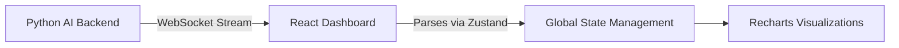

> [!NOTE]
> This project is currently in active development and will be launching soon.

## Concept & Problem Statement

The goal of this project is to build an intuitive, high-performance dashboard that parses complex datasets into easily readable metrics for business analysts, leveraging AI-generated summaries of market trends.

## Planned Features

- **Real-Time WebSockets**: Streaming data updates for live metric tiles without manual page refreshes.
- **Advanced Theming**: Context-aware color palettes based on data health (e.g., using semantic red gradients for negative trends).
- **Interactive Component System**: Heavily relying on Recharts for custom multi-axis charts that respond to timeline sliding.

## Expected Architecture

Check back soon for updates as pieces of this dashboard come to life!
