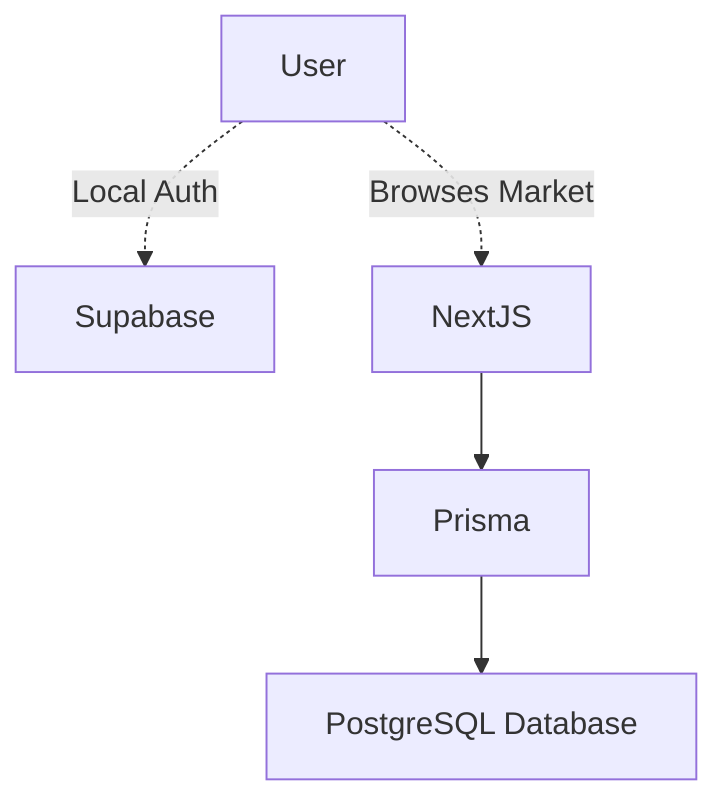

> [!TIP]
> This project is currently in the brainstorming and wireframing phase!

## Concept

Created to simplify peer-to-peer campus commerce specifically for students at Accra Technical University. Textbooks are expensive, and this app aims to provide a safe, localized alternative to standard untrustworthy online marketplaces.

## Planned Features

- **Authentication via University Email**: Restricting access to verify student status locally via OAuth constraints.
- **Location-based Search**: Highlighting proximity markers for safe meetups on campus.
- **Real-time Chat**: Integrated messaging using Supabase realtime subscriptions.

## Database Strategy 

