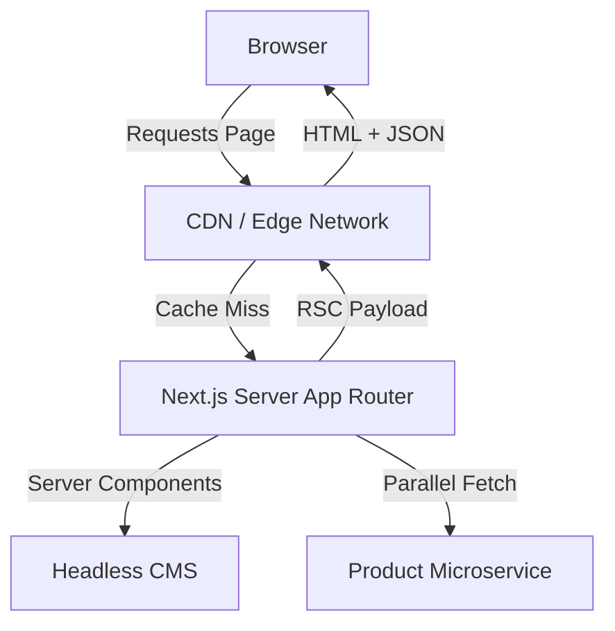

## Problem Statement & Solution

Our client's legacy e-commerce application was built on an aging SPA framework that suffered from slow Initial Load times, poor SEO indexing, and a rigid monolithic backend. 
The solution was to decouple the frontend using **Next.js App Router**, leveraging React Server Components for heavy lifting, and streaming data for instant perceived load times.

## Technical Architecture



## Performance Before/After Metrics

By transitioning to an Edge-rendered React Server Component architecture, we achieved dramatic Lighthouse score improvements:

| Metric | Legacy SPA | Next.js Architecture | Improvement |
| :--- | :--- | :--- | :--- |
| **LCP** | 4.8s | 0.9s | -81% |
| **CLS** | 0.45 | 0.01 | -98% |
| **TBT** | 850ms | 45ms | -95% |
| **Bundle Size**| 1.2MB | 85KB | -93% |

## Challenges & Solutions

### 1. Complex State Syncing
**Challenge**: The cart state was deeply entangled in global Redux stores and persisted randomly to LocalStorage.
**Solution**: We moved the source of truth to the server using HTTP-only cookies and React Server Actions to mutate the cart, maintaining UI optimism via \`useOptimistic\`.

### Key Implementations

Here's an example of how we handled the optimistic cart updates:

```tsx
'use client'

import { useOptimistic } from 'react'
import { addToCartAction } from '@/actions/cart'

export function AddToCartButton({ productId, initialQuantity }) {
  const [optimisticQuantity, addOptimistic] = useOptimistic(
    initialQuantity,
    (state, current) => state + current
  )

  const handleAdd = async () => {
    addOptimistic(1)
    await addToCartAction(productId)
  }

  return (
    <button onClick={handleAdd} className="bg-primary text-white px-4 py-2 rounded">
      Add to Cart ({optimisticQuantity})
    </button>
  )
}
```

## Lessons Learned

- **Server Components are a paradigm shift:** We had to unlearn heavy client-side state management patterns.
- **Micro-optimizations add up:** Moving third-party scripts to Web Workers (Partytown) drastically reduced TBT.
