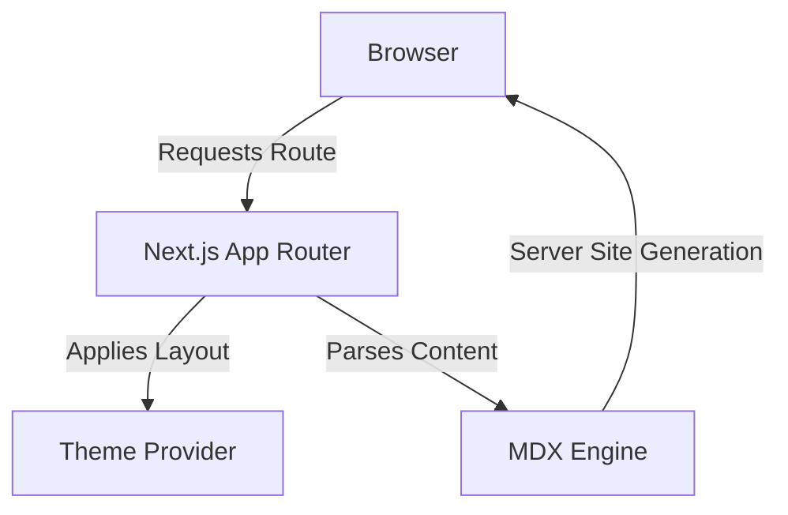

## Project Overview

This is the very portfolio you are currently looking at! It was built from the ground up using modern web technologies to serve not just as a static resume, but as a living sandbox and a demonstration of interactive frontend architecture.

## Key Features

- **Live Code Editor**: Embedded interactive code challenges using Monaco Editor (`/playground`), allowing visitors to live-edit React components.
- **Performance Dashboards**: Visualizing Lighthouse and Core Web Vitals via Recharts (`/performance`).
- **Dynamic Theming**: Seamless light/dark mode transitions built using pure CSS variables and `next-themes`.
- **MDX Engine**: Custom `.mdx` rendering for dynamically generating blog posts and comprehensive case studies.

## Architectural Strategy

The website is served entirely via the new **Next.js App Router**, leveraging server components heavily for the MDX parsing layer, and gracefully handing off to client components specifically for animations and interactive graphs.

## Accomplishments

Building this portfolio allowed me to practice scaling a design system from scratch using **Tailwind CSS v4**'s new variable mechanics, while proving my proficiency in modern React patterns and dynamic routing.
