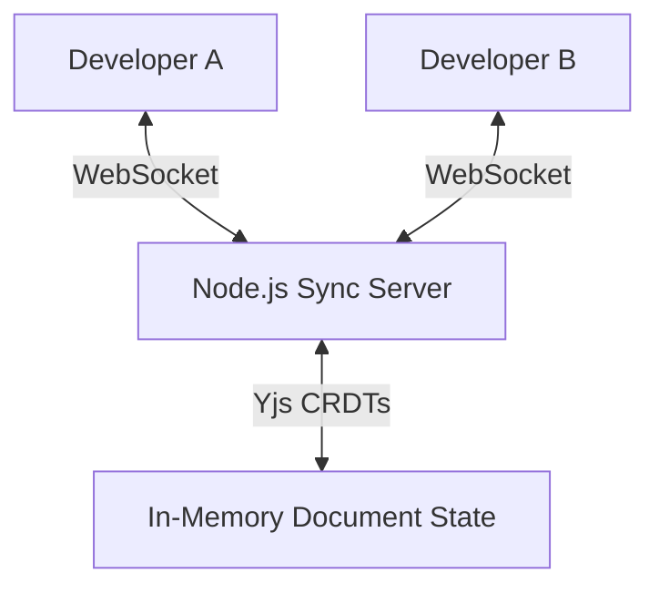

## Overview

DevSpace is a web-based integrated development environment designed to make remote pair programming as seamless as sitting next to your teammate. It allows multiple developers to edit the same codebase simultaneously with nearly zero latency.

## Core Features

- **Real-Time Collaboration**: Powered by `Yjs` and WebSockets, changes are synced instantly across all connected clients.
- **Live Presence**: View teammate cursors and active selections in real-time.
- **Instant Previews**: Built-in browser bundler to render live previews of React code directly in the viewport.

## Technical Implementation

By leveraging Conflict-free Replicated Data Types (CRDTs), the editor ensures that concurrent edits are merged deterministically without the need for a central conflict resolution authority.
